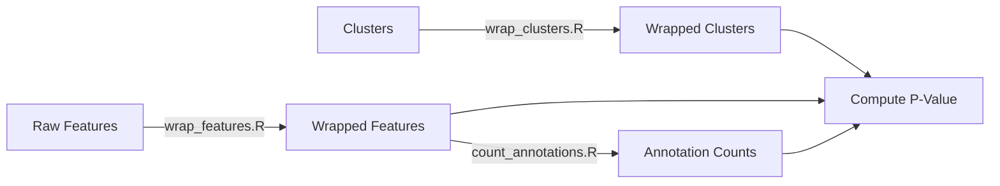

# Bootstrapping pipeline

# Introduction
This is a pipeline to calculate the p-value of the association between particular genomics features and genomic clusters using a bootstrapping approach.

# Pipeline Structure:

# Scripts
## 1. wrap_features.R 
The script wraps the input data in a *GenomicRange* object to speed up the calculation of intersections on BED files.

### Accepted Parameters:
- *data* (*d*): the given feature file. Currently accepts a **Rda** file.
- *output* (*o*): The path of the output file.

### Input Files:
- __feature_in.Rda__: the input data containing the relevant features.

### Output Files:
- __features_wrapped.Rda__: The features wrapped in a genomic range.

## 2. count_annotations.R
The script counts the number of annotations for each feature type (5'utr, 3'utr, exon, intron, intergenic etc).

### Accepted parameters:
- *data* (*d*): the wrapped features file. Currently accepts a **Rda** file.
- *annotation* (*a*): the path to the folder containing annotations. Currently this folder is expected to contains subfolders for each chromosome.
- *out* (*o*): The path of the output file.

### Inputs:
- __features_wrapped.Rda__: The features wrapped in a GenomicRange object.

### Outputs: 
- __annotations.tsv__: A tsv file containing the number of annotations for each feature type

## 3. wrap_clusters.R
The script wraps the cluster data in a *GenomicRange* object to speed up the calculation of intersections on BED files.

### Inputs:
- *input* (*i*): The path of the folder containing the cluster data for the chromosomes.
- *out* (*o*): The path of the output folder.

## 4. compute_pvalue.R
The script computes the p-value of the association between the features and the clusters.

### Inputs:
- __features_wrapped.Rda__: The features wrapped in a GenomicRange object.
- __annotations.tsv__: The number of annotations for each feature type.
- **clusters**: The clusters wrapped in a GenomicRange object.

### Outputs:
- __pvalue.tsv__: The p-value of the association between the features and the clusters.

### Accepted parameters:
- *bootstrap* (*b*): The number of bootstraps (default is 10).
- *clusters* (*c*): The Path to the folder containing the clusters wrapped in a GenomicRange object.
- *features* (*f*): The Path to the file containing the features wrapped in a GenomicRange object.
- *genome* (*g*): The Path to the genome file.
- *annotations* (*a*): The Path to the file containing the number of annotations for each feature type.
- *workers* (*w*): The number of workers to use (default is 3).

# File Structure:
## Input
The pipeline expects a folder structure like this:
- data/features/[cell line]/[feature type].Rda
- data/clusters/[cell line]/[cluster type]/[chromosome].Rda

## Intermediate Files
The pipeline creates a folder structure like this:
- data/features/[cell line]/[feature type]_wrapped.Rda (the features wrapped into a GRange object)
- data/clusters/[cell line]/[cluster type]/[chromosome]_wrapped.Rda (the clusters wrapped into a GRange object)
- data/features/[cell line]/annotations.Rda (the annotations for each feature type)

# Output
Finally the pipeline creates an output file in the following format:
- data/output/[cell line].[feature type]_[cluster type]_[chromosome].Rda (the output file)

# Conventions
In the naming of the parameters the following conventions are used:
- *line* is the name of the cell line.
- *type* is the name of the feature type.